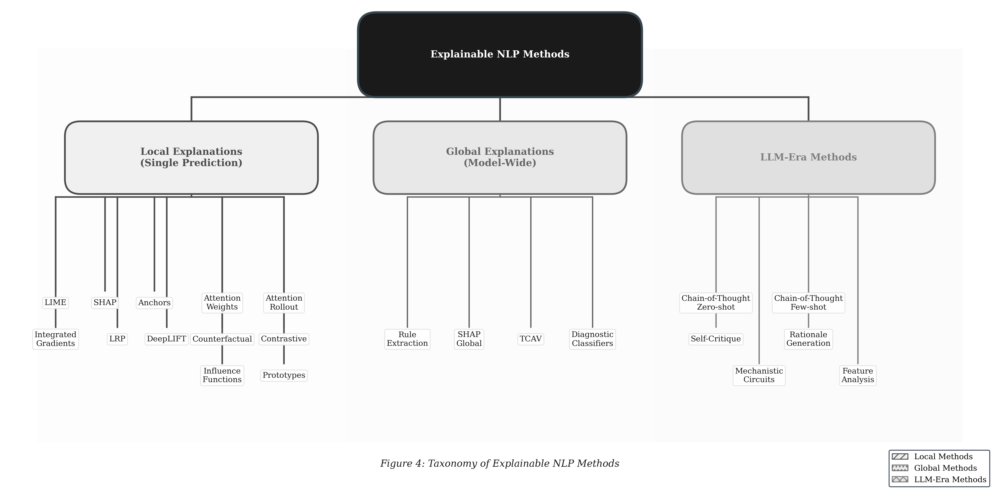
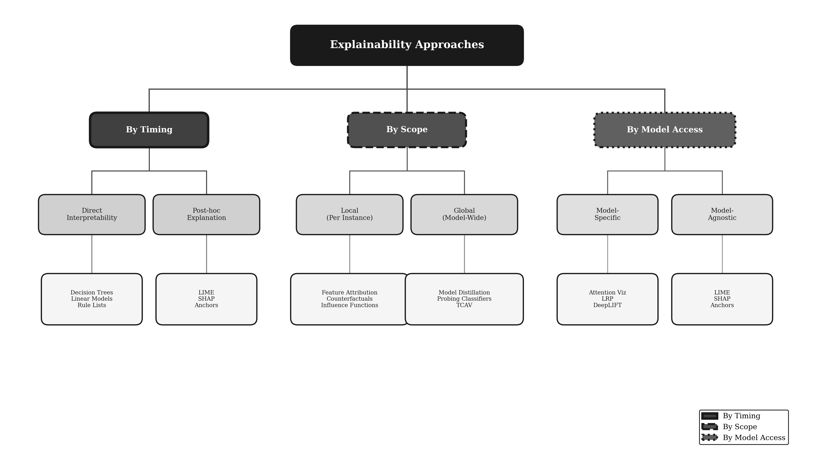

<div align="center">

# XNLP Technical Survey

### A Technical Survey of Explainability Methods for Natural Language Processing

[](https://creativecommons.org/licenses/by/4.0/)
[](https://arxiv.org/abs/submit/7129047)

*A comprehensive survey covering 200+ papers on explainability methods for NLP*

[Paper](https://arxiv.org/abs/submit/7129047) • [Code](https://github.com/mohammadi-hadi/XNLP_technical_Survey_code) • [Website](https://mohammadi.cv)

---

</div>

## Paper

**Title:** A Technical Survey of Explainability Methods for Natural Language Processing

**Authors:** Hadi Mohammadi, Anastasia Giachanou, Ayoub Bagheri

**Affiliation:** Utrecht University, The Netherlands

**arXiv:** [submit/7129047](https://arxiv.org/abs/submit/7129047) *(under review)*

## Abstract

Explainable natural language processing (XNLP) is a rapidly evolving field that aims to make machine learning models more transparent and understandable to humans. This survey provides a comprehensive overview of explainability methods for NLP, covering over 200 papers across multiple dimensions:

- **Attribution Methods:** SHAP, LIME, Integrated Gradients, and attention-based explanations
- **Probing Classifiers:** Understanding learned representations
- **Mechanistic Interpretability:** Circuit analysis and feature visualization
- **Human Evaluation:** Measuring explanation quality and utility

<div align="center">

<br><i>Taxonomy of explainability methods for NLP</i>
</div>

## Survey Statistics

| Category | Count |
|----------|-------|
| Total Papers Reviewed | 200+ |
| Attribution Methods | 75+ |
| Probing Methods | 40+ |
| Mechanistic Interpretability | 30+ |
| Evaluation Studies | 55+ |

## Key Contributions

1. Systematic taxonomy of XNLP methods organized by methodology and application
2. Analysis of evaluation approaches for NLP explanations
3. Practical guidelines for implementing explainability in NLP systems
4. Discussion of challenges and future research directions

## Reading Guide

| Section | Topics Covered | Recommended For |
|---------|----------------|-----------------|
| Section 2 | Background & Definitions | Everyone |
| Section 3 | Attribution Methods | Practitioners |
| Section 4 | Probing Classifiers | Researchers |
| Section 5 | Mechanistic Interpretability | Advanced |
| Section 6 | Evaluation | Everyone |
| Section 7 | Future Directions | Researchers |

<div align="center">

<br><i>Overview of different explainability approaches</i>
</div>

## Repository Contents

```
XNLP_technical_Survey/
├── paper.pdf              # Full paper
├── figures/               # Figures from the paper
└── README.md              # This file
```

## Citation

```bibtex
@article{mohammadi2025xnlp,
  title={A Technical Survey of Explainability Methods for Natural Language Processing},
  author={Mohammadi, Hadi and Giachanou, Anastasia and Bagheri, Ayoub},
  journal={arXiv preprint arXiv:submit/7129047},
  year={2025},
  note={Under review}
}
```

## Related Work

This survey is part of the PhD thesis "From Tokens to Thoughts: Explainable NLP for Understanding Large Language Models" by Hadi Mohammadi at Utrecht University (2025).

## License

This work is licensed under [CC BY 4.0](https://creativecommons.org/licenses/by/4.0/).

## Contact

- Hadi Mohammadi - [h.mohammadi@uu.nl](mailto:h.mohammadi@uu.nl)
- Website: [mohammadi.cv](https://mohammadi.cv)
